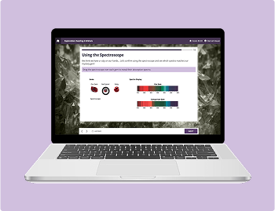
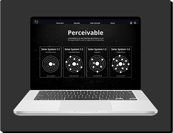
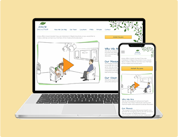

# Hannah Hauan (UX & LX)
## About Me
- I create digital products, e-learning, and technical training. 
- Love prototyping in **Figma**, building **interactive learning**, and simplifying complex systems  
- Huge nature nerd, huge photography nerd - check out my  📸 [favorite photos](https://www.hannahhauan.com/about-me)
### Favorite Tools
`Figma` · `Articulate Storyline` · `HTML/CSS/JS` · `Camtasia` · `LMS`  · `Illustrator` · `Photoshop` · `After Effects` · `Premiere Pro` · `WCAG 2.2` · `User Research` · `Collaboration` · `Empathy`
### Featured Projects
<table style="width:100%;">
  <tr>
      <td>
    
       
      <b>Interactive Chemistry Course</b> 
       Learning Design | Animation
       
    </td>
    <td>
       
       
      <b>WCAG 2.2 Gamified Learning</b>
       
      Accessibility | Game Mechanics
       
    </td>
    <td>
         
         
        <b>Company Website</b> 
          UX | Illustration | Animation
         
     </td>
  </tr>
</table>

### Let's Connect
  

