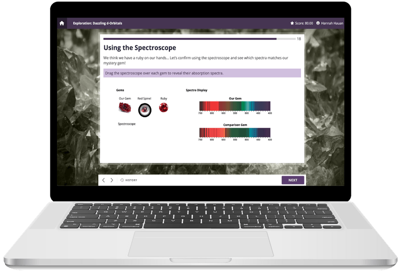
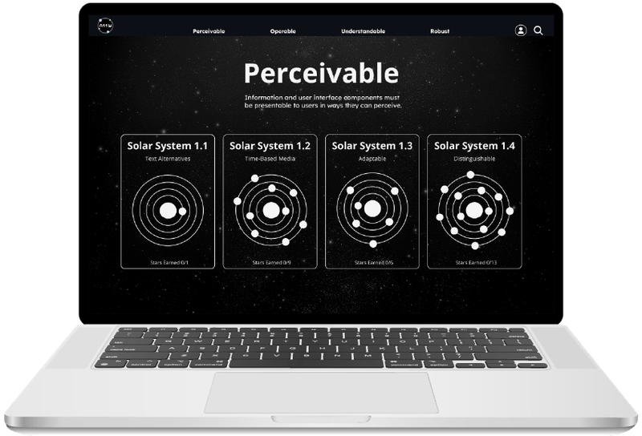
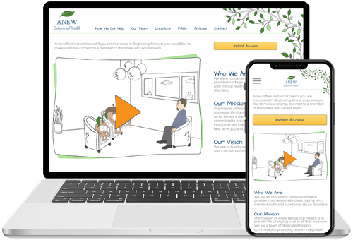

# Hannah Hauan
**Learning Experience Designer / UX**  
Designing accessible, data-informed learning & product experiences.

 
<a href="https://www.hannahhauan.com" target="_blank">

---

### About Me
- UX/LX designer focused on **accessibility (WCAG 2.2)** and measurable outcomes  
- Love prototyping in **Figma**, building **interactive learning**, and simplifying complex systems  

### Design Work
<grid>
<table>
  <tr>
      <td>
    
       
      <b>Interactive Chemistry Course</b> 
       Learning Design | Animation
       
    </td>
    <td>
       
      <b>WCAG 2.2 Gamified Learning</b>
       
      Accessibility | Game Mechanics | Web Design
       
    </td>
    <td>
         
         
        <b>Company Website</b> 
          UX | Illustration | Animation
         
     </td>
  </tr>
</table>

### Toolbelt
`Figma` · `Storyline` · `HTML/CSS/JS` · `Camtasia` · `LMS` · `Mural` · `User Research`

