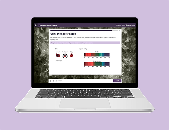
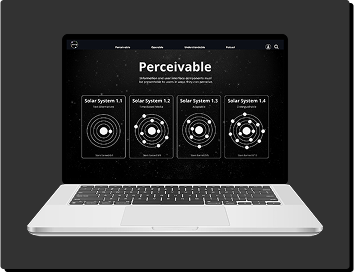
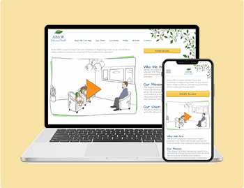

# Hannah Hauan (UX & LX)
## About Me
💼 I lead Learning Design at **Lucid Motors**.
 
🤓 I am graduating with a MS in UX Design from Arizona State University in May 2026.
 
🎨 I create digital products, e-learning, and technical training (11 years of experience in education + design).
 
📚 I love prototyping with **Claude** and **Figma**, building **interactive learning with Articulate**, and simplifying complex systems.
 
🌵 I am a nature nerd + photography nerd =  📸 [macrophotography](https://www.hannahhauan.com/about-me)

### Featured Projects
<table style="width:100%;">
  <tr>
      <td>
    
       
      <b>Interactive Chemistry Course</b> 
       Learning Design | Animation
       
    </td>
    <td>
       
       
      <b>WCAG 2.2 Gamified Learning</b>
       
      Accessibility | Game Mechanics
       
    </td>
    <td>
         
         
        <b>Company Website</b> 
          UX | Illustration | Animation
         
     </td>
  </tr>
</table>

### Favorite Tools
`Figma` · `Articulate Storyline` · `HTML/CSS/JS` · `Camtasia` · `LMS`  · `Illustrator` · `Photoshop` · `After Effects` · `Premiere Pro` · `WCAG 2.2` · `User Research` · `Collaboration` · `Empathy`

### Let's Connect
  

